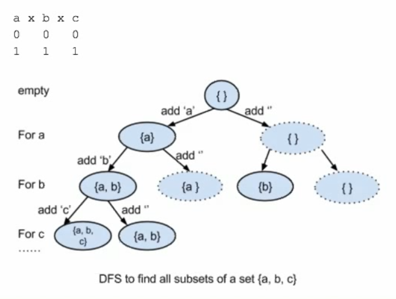

## DFS 基本方法：

1. what does it store on each level? (每层代表什么意义？一般来讲解题之前就知道 DFS 要 recurse 多少层)

2. how many different states should we try to put on this level? (每层有多少个状态/case 需要 try?)

### DFS 经典例题 1 Print all subsets of a set S = {'a', 'b', 'c'}



```js
/**
 * 这种题其实就是数学上的cross-product问题
 * a x b x c
 * 0   0   0
 * 1   1   1
 */
/**
 *
 * @param {string} input
 * @param {number} layer
 * @param {string} solution
 * @returns {void}
 */
function subset(input, layer, solution) {
  // **DFS基本方法：**
  // 1. what does it store on each level?
  /**
   * for each level, it makes the decision on whether to put this element into the final set or not.
   * n element --> n layers.
   */
  // 2. how many different states should we try to put on this level?
  /**
   * two, each state(case) considers either select or not select
   */
  if (layer === input.length) {
    return solution;
  }
  solution.push(input[layer]);
  subset(input, layer + 1, solution);
  // don't forget to pop element.
  solution.pop();
  subset(input, layer + 1, solution);
}
function findAllSubsets(input) {
  subset(input, 0, "");
}
/**
 * Time: 2^n
 */
```

### DFS 经典例题 2 ()()() find all valid permutation using the parenthesis provided.

```js
/**
 * @param {number} n 总共有“n对儿”符号需要加 总高度是2*n
 * @param {number} leftNum 目前已有左括号数量
 * @param {number} rightNum 目前已有右括号数量
 * @param {number} prefix 当前已拼接的有效组合
 */
function validPermutation(n, leftNum, rightNum, prefix) {
  // **DFS基本方法：**
  // 1. what does it store on each level?
  /**
   * 2n level. each level represents a position in which we could place a either '(' or ')'.
   * 我们在每一层中，要么选择'('或者是')'
   */
  // 2. how many different states should we try to put on this level?
  // two.

  if (leftNum === n || rightNum === n) {
    console.log(prefix);
    return;
  }
  if (leftNum < n) {
    prefix.push("(");
    validPermutation(n, leftNum + 1, rightNum, prefix);
    prefix.pop();
  }
  if (rightNum < leftNum) {
    prefix.push(")");
    validPermutation(n, leftNum, rightNum + 1, prefix);
    prefix.pop();
  }
}
```

### DFS 经典例题 3 Print all combinations of coins that can sum up to a total value k.

````js
// DFS经典例题3 Print all combinations of coins that can sum up to a total value k.
// E.g. total value k = 99cents.
// coin value = 25 10 5 1 cent

// Solution1
// **DFS基本方法：**
// 1. what does it store on each level?
/**
 * 99 layers, each layer represents we take only 1 coin out of my hand.
 */
// 2. how many different states should we try to put on this level?
// four branches (25, 10, 5, 1)
/**
 *                                   root = 99cents
 *                      /            |               \           \
 * level1         25(74rem)       10(89rem)         5(94rem)   1(98rem)
 *             /      |  ....
 * level2  25(49rem)  10(64rem) ....
 */

// Solution2
// 1. what does it store on each level?
/**
 * four layers. each level represents considering one type of coin
 */
// 2. how many different states should we try to put on this level?
/**
 *  dynamically changing value (k-nary tree)
 */

/**
 *                                   root = 99cents
 *                      /            |               \           \
 * level1  25cent      0x25(99rem)  1x25(74rem)  2x25(49rem)  3x25(24rem)
 *                   / |||||||\
 * level2  10cent 0x10(99rem) 1x10(89rem) ...
 */
const coin = [25, 10, 5, 1];
/**
 *
 * @param {number} money_left
 * @param {number} level
 * @param {[number,number,number,number]} result
 */
function findCombination(money_left = 99, level = 0, result) {
  if (level === 3) {
    // 最后一层是 1cent
    result[level] = money_left;
    console.log(result);
    return;
  }
  for (let i = 0; i <= Math.floor(money_left / coin[level]); i++) {
    result[level] = i;
    findCombination(money_left - coin[level] * i, level + 1, result);
  }
}```

### DFS经典例题4 given a string with no duplicated letters, how to print out all permutations of the string;

```js
/**
 * string = 'abc'
 * E.g 'abc'
 *     'acb'
 *     'bac'
 *     ...
 *
 *                              root = 'abc'
 *                      /             |               \
 * level1         a(bc)             b(ac)             c(ab)
 *                /   \             /    \             /     \
 * level2     b(c)   c(b)        a(c)    c(a)         a(b)   b(a)
 *             |      |            |      |            |       |
 * level3      c      b           c      a             b       a
 *
 * Time = O(n!)
 */
/**
 * 1. what does it store on each level? (每层代表什么意义？一般来讲解题之前就知道DFS要recurse多少层)
 *    每层代表从剩下的letters中遍历的抽取一个letter作为一种组合方式 将其放到最终返回的letters中
 *    layer层数和需要组合的string长度相等
 * 2. how many different states should we try to put on this level? (每层有多少个状态/case需要try?)
 *    remained unused letters
 */
// toPermutateLetters 剩下的，待排列的letters；permutatedLetters 已经排列好的letters
function permutation(toPermutateLetters, permutatedLetters = "") {
  if (!toPermutateLetters.length) {
    console.log(permutatedLetters);
  }
  for (let i = 0; i < toPermutateLetters.length; i++) {
    const toPermudate = toPermutateLetters
      .slice(0, i)
      .concat(toPermutateLetters.slice(i + 1));
    permutation(toPermudate, `${permutatedLetters}${toPermutateLetters[i]}`);
  }
}

function swap(str, i, j) {
  [str[i], str[j]] = [str[j], str[i]];
}

// optimized version
function permutation2(input, index = 0) {
  if (index === input.length) {
    console.log(input);
    return;
  }
  for (let i = index; i < input.length; i++) {
    swap(input, index, i);
    permutation2(input, index + 1);
    swap(input, index, i);
  }
}
````

subset问题和combination问题的本质都是一类问题，都是组合的思想。因此解决的思路也是一样的。