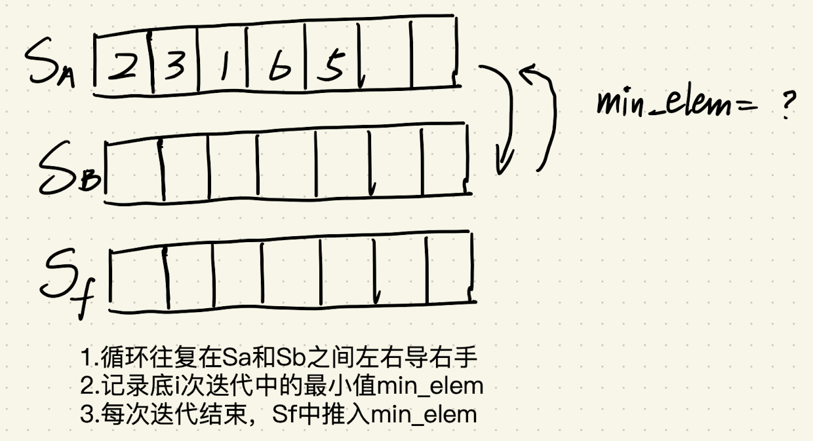
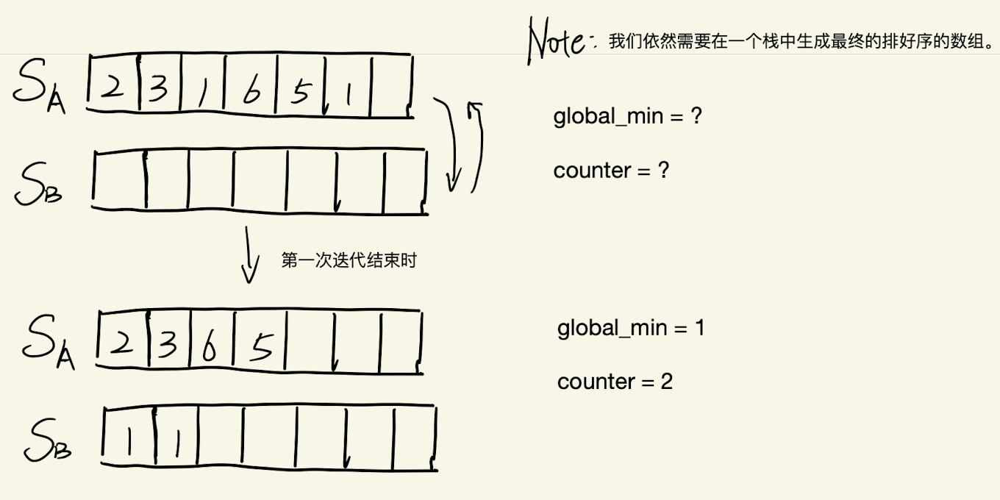

Stack 类的实现在文末。下文中是三栈以及双栈实现的选择排序。

## 三栈排序



```js
// 三栈排序
function selectionSortWith3Stack(stack) {
  const stack2 = new Stack();
  const stack3 = new Stack();
  function sort(s1, s2, s3) {
    if (s1.isEmpty()) {
      return;
    }
    // 我们会打乱s2中的值的顺序 但是这个我们并不关心 因为我们只需要找到此次迭代最小的就行
    let curMin = s1.pop();
    while (!s1.isEmpty()) {
      if (s1.peek() < curMin) {
        s2.push(curMin);
        curMin = s1.pop();
      } else {
        s2.push(s1.pop());
      }
    }
    s3.push(curMin);
    sort(s2, s1, s3); // 左手导右手 右手导左手 循环往复
  }
  sort(stack, stack2, stack3);
  return stack3;
}
```

## 两栈排序



```js
// 两栈排序
function sortArrayWithTwoStack() {
  const stack2 = new Stack();
  // 需要在一个stack中积累有序的栈
  function sort(s1, s2) {
    if (s1.isEmpty()) {
      return;
    }
    let curMin;
    // 避免有重复元素的方法 使用一个counter记录当前最小值出现的次数
    let curMinCounter;
    while (!s1.isEmpty()) {
      if (curMin === undefined) {
        curMin = s1.peek();
        curMinCounter = 1;
      } else if (s1.peek() === curMin) {
        // if判断中出现副作用 下面紧接着if语句不能想当然的不写else
        curMinCounter += 1;
      } else if (s1.peek() < curMin) {
        curMin = s1.peek();
        curMinCounter = 1;
      }
      s2.push(s1.pop());
    }
    while (s2.peek() >= curMin) {
      const elem = s2.pop();
      if (elem === curMin) {
        continue;
      }
      s1.push(elem);
    }
    while (curMinCounter > 0) {
      s2.push(curMin);
      curMinCounter -= 1;
    }
    // 进行下一轮遍历
    sort(s1, s2);
  }
  sort(stack, stack2);
  return stack2;
}
```

```js
class Stack {
  constructor() {
    this.data = [];
    this.top = 0;
  }
  push(element) {
    this.data[this.top] = element;
    this.top = this.top + 1;
  }
  length() {
    return this.top;
  }
  peek() {
    return this.data[this.top - 1];
  }
  isEmpty() {
    return this.top === 0;
  }
  pop() {
    if (this.isEmpty() === false) {
      this.top = this.top - 1;
      return this.data.pop(); // removes the last element
    }
  }
  print() {
    var top = this.top - 1; // because top points to index where new    element to be inserted
    while (top >= 0) {
      // print upto 0th index
      console.log(this.data[top]);
      top--;
    }
  }
  reverse() {
    this._reverse(this.top - 1);
  }
  _reverse(index) {
    if (index != 0) {
      this._reverse(index - 1);
    }
    console.log(this.data[index]);
  }
}
```
