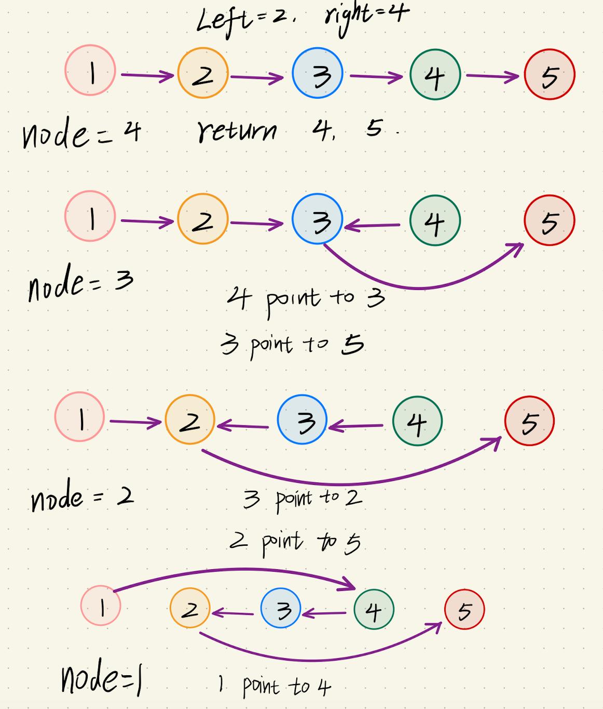

<p>Given the <code>head</code> of a singly linked list and two integers <code>left</code> and <code>right</code> where <code>left &lt;= right</code>, reverse the nodes of the list from position <code>left</code> to position <code>right</code>, and return <em>the reversed list</em>.</p>

<p>&nbsp;</p>
<p><strong>Example 1:</strong></p>

<pre>
<strong>Input:</strong> head = [1,2,3,4,5], left = 2, right = 4
<strong>Output:</strong> [1,4,3,2,5]
</pre>

<p><strong>Example 2:</strong></p>

<pre>
<strong>Input:</strong> head = [5], left = 1, right = 1
<strong>Output:</strong> [5]
</pre>

<p>&nbsp;</p>
<p><strong>Constraints:</strong></p>

<ul>
	<li>The number of nodes in the list is <code>n</code>.</li>
	<li><code>1 &lt;= n &lt;= 500</code></li>
	<li><code>-500 &lt;= Node.val &lt;= 500</code></li>
	<li><code>1 &lt;= left &lt;= right &lt;= n</code></li>
</ul>

<p>&nbsp;</p>
<strong>Follow up:</strong> Could you do it in one pass?<div><div>Related Topics</div><div><li>链表</li></div></div><br><div><li>👍 1148</li><li>👎 0</li></div>



```js
function reverseBetween(head, left, right) {
  /**
   * 1. 先找到节点left-1位 保存。
   * 2. 从第left个元素递归的迭代链表，直到找到第right个元素为止。
   *    base case为当前元素是第right个元素
   *    函数返回第right个元素以及第right+1个元素。
   * 3. 递归规则：
   *    函数递归栈抛出时，node指向已翻转的node的前一个节点
   *    技巧：函数当前节点的next不再指向null 而是指向tailNode
   *          这样递归完成之后left节点自然的指向了right+1个节点。
   *    最后将第right个节点的指向和第left-1个连接上就可以了。
   *
   */
  function helper(node, cur) {
    if (cur === right) {
      return [node, node ? node.next : null];
    }
    const [firstNode, tailNode] = helper(node.next, cur + 1);
    node.next.next = node;
    node.next = tailNode;
    return [firstNode, tailNode];
  }
  const dummyHead = new ListNode(undefined, head);
  let curNode = dummyHead;
  let i = 1;
  while (i < left) {
    curNode = curNode.next;
    i++;
  }
  const [firstNode] = helper(curNode.next, left);
  curNode.next = firstNode;
  return dummyHead.next;
}
```
